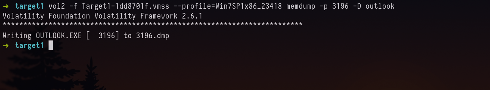

We are given with three samples of memory dump (suspended state file of VMware). Before we proceed this challenge file was from [CyberDefenders](https://cyberdefenders.org/blueteam-ctf-challenges/88), which has the memory dump samples and relevant questionaries. This challenge is hosted by the platform, when the challenge author submits it after event. 

---

**1.** **Machine: Target1 - What email address tricked the front desk employee into installing a security update?**

First we shall use volatility to get a visual representation of the process tree. 

`vol2 -f Target1-1dd8701f.vmss --profile=Win7SP1x86_23418 pstree --output=dot --output-file=visual.dot`



To get the above picture, from DOT file I used online [convertor](https://onlineconvertfree.com/convert-format/dot-to-png/) or you can use [XDOT](https://www.notion.so/MrRobot-22a6fdcbc4a44b58b05ec2ea79b77e2f) or any preferred method of yours

Now we are asked to find the email address that tricked the front desk employee, which we can do by first extracting the `.PST`  (Personal Storage Table) file(s) of outlook. We can do this by using filescan and dumpfiles or we could also try to dump the memory of the process. 

`vol2 -f Target1-1dd8701f.vmss --profile=Win7SP1x86_23418 filescan | grep -i "\.pst"`

This didn’t give any result, lets try the other way.

`vol2 -f Target1-1dd8701f.vmss --profile=Win7SP1x86_23418 pslist | grep -i "outlook"`

now make a directory outlook, and then dump the memory of the process.

`vol2 -f Target1-1dd8701f.vmss --profile=Win7SP1x86_23418 memdump -p 3196 -D outlook` 

Let’s use strings to identify **FROM** address. 

**Answer:** th3wh1t3r0s3@gmail.com

---

**2. Machine: Target1 - What is the filename that was delivered in the email?**

We can use strings again to extract

`strings -el -td 3196.dmp | grep -i "\.exe" | less`

after scrolling a bit, I found the email content and the attachment. You maybe like how I know attachment could be `.exe` . I don’t know. I took educated guess (as it was windows) only few files can infect upon download and execution phase. 

`http://180.76.254.120/AnyConnectInstaller.exe`

**Answer:** AnyConnectInstaller.exe

---

**3.** **Machine: Target1 - What is the name of the rat's family used by the attacker?**

we shall look for the file `AnyConnectInstaller.exe` and extract it.

`vol2 -f Target1-1dd8701f.vmss --profile=Win7SP1x86_23418 filescan | grep -i "AnyConnectInstaller\.exe"`

if you notice carefully, the one which is download folder is what we need, other files are preinstalled I assume. We can any way check that on later stage comparing the md5sum of the Installed location and Downloaded path.

`vol2 -f Target1-1dd8701f.vmss --profile=Win7SP1x86_23418 dumpfiles -Q 0x000000003e0bc5e0 -D .`

Two files were extracted, with .img and .dat extensions. I assume .dat is the executable, for confirmation we can check the md5sum hash in virustotal. Both md5 hash of [.img](https://www.virustotal.com/gui/file/92a803f357213552a5f24b80420999baaabe5d1e1b35afc02fd4ff9555f40172) and [.dat](https://www.virustotal.com/gui/file/94a4ef65f99c594a8bfbfbc57f369ec2b6a5cf789f91be89976086aaa507cd47) is flagged.

**Answer:** XtremeRAT 

---

**4.** **Machine: Target1 -The malware appears to be leveraging process injection. What is the PID of the process that is injected?**

Process Injection is a common technique used by malwares. When process is started it will have VAD (Virtual Address Descriptor) or Memory Protection will be `PAGE_EXECUTE_WRITECOPY` . If there Process Injection has taken place then the memory protection for the executable will be `PAGE_READWRITE` . To know more about it watch the explanation [video](https://youtu.be/BMFCdAGxVN4?t=2382) by Monnappa K A at Blackhat Conference and read the [article](https://www.notion.so/MrRobot-22a6fdcbc4a44b58b05ec2ea79b77e2f). I have used hollowfind plugin which is not shipped by volatility, but a community plugin written by Monnappa K A. 

`vol2 -f Target1-1dd8701f.vmss --profile=Win7SP1x86_23418 hollowfind`

**Answer: 2996**

*P.S Another thing that made iexplore.exe more suspicious is because of the child process of iexplore.exe which were cmd.exe.* 

---

**5.** **Machine: Target1 - What is the unique value the malware is using to maintain persistence after reboot?**

By value I assume Registry keys and value. Which are always used by malware to have persistence to autorun upon reboot. To know more about the autorun capabilities read the [article](https://twoicefish-secu.tistory.com/59) and [The Art of Persistence](https://www.cynet.com/attack-techniques-hands-on/the-art-of-persistence/). From the article we know the Registry, which is targeted `Microsoft\Windows\CurrentVersion\Run`

Let’s use `printkey` plugin to print the registry.

**Answer:** MrRobot

---

**6.** **Machine: Target1 - Malware often uses a unique value or name to ensure that only one copy runs on the system. What is the unique name the malware is using?**

I googled “How to Run Only One Instance of Application”. I found this [stackoverflow](https://www.notion.so/MrRobot-22a6fdcbc4a44b58b05ec2ea79b77e2f). Which says mutex. Later after some google, I figured volatility has a plugin called `mutantscan - Pool scanner for mutex objects` .

As the name suggests scans for mutex objects of the process. 

`vol2 -f Target1-1dd8701f.vmss --profile=Win7SP1x86_23418 mutantscan`

We can also confirm if that is the file used by Process which is injected (PID: 2996, iexplore.exe) is by using `handles` plugins.

`vol2 -f Target1-1dd8701f.vmss --profile=Win7SP1x86_23418 handles -t Mutant -p 2996`

**Answer:** fsociety0.dat

---

**7.** **Machine: Target1 - It appears that a notorious hacker compromised this box before our current attackers. Name the movie he or she is from.**

I didn’t have idea for this, it seems **MFT** (Master File Record) Records was the solution it seems. We use `mftparser` plugin to extract the NTFS file system, in which usernames of the user directories which existed once are listed.

`vol2 -f Target1-1dd8701f.vmss --profile=Win7SP1x86_23418 mftparser | grep "Users"`

From this we know that `zerocool` is a character/reference in movie called Hackers. 

**Answer:** Hackers

---

**8.** **Machine: Target1 - What is the NTLM password hash for the administrator account?**

`vol2 -f Target1-1dd8701f.vmss --profile=Win7SP1x86_23418 hashdump`

**Answer:** 79402b7671c317877b8b954b3311fa82

---

**9.** **Machine: Target1 - The attackers appear to have moved over some tools to the compromised front desk host. How many tools did the attacker move?**

First dump the memory of process 2996. Then we shall use strings to grep some popular extensions which bad actors use. 

`strings -el -td 2996.dmp | grep -i "\.exe"`

There are lots of exes, this method might not be a good one. But I came to conclusion after looking and timeline in MFT records that 3 exes were downloaded to filesystem. Which are `nbtscan.exe, Rar.exe, wce.exe`

**Answer:** 3

---

**10.** **Machine: Target1 - What is the password for the front desk local administrator account?**

We noticed previously that wce.exe was downloaded. It is Windows Credential Editor.

Let’s try to find the command executed by it. 

`vol2 -f Target1-1dd8701f.vmss --profile=Win7SP1x86_23418 cmdscan`

Looks like `w.tmp`. We shall dump the file.

`vol2 -f Target1-1dd8701f.vmss --profile=Win7SP1x86_23418 filescan | grep "w.tmp"`

`vol2 -f Target1-1dd8701f.vmss --profile=Win7SP1x86_23418 dumpfiles -Q 0x000000003eca37f8 -D .`

`xxd file.None.0x85b684b0.dat | less`

If you’ve ever used tools from sysinternals by windows. You know the command execution format. Which has `Username\Domain:Password Command` . From which the password in above seems to be `flagadmin@1234`

**Answer:** flagadmin@1234

---

**11.** **Machine: Target1 - What is the std create data timestamp for the nbtscan.exe tool?**

We already have the MFT Records saved in a file. We shall grep from it.

`cat mft.txt | grep -i "nbtscan\.exe"`

Creation, Modification and Access Time all have same.

**Answer:** 2015-10-09 10:45:12 UTC

---

**12.** **Machine: Target1 - The attackers appear to have stored the output from the nbtscan.exe tool in a text file on a disk called nbs.txt. What is the IP address of the first machine in that file?**

`vol2 -f Target1-1dd8701f.vmss --profile=Win7SP1x86_23418 filescan | grep "nbs.\txt"`

`vol2 -f Target1-1dd8701f.vmss --profile=Win7SP1x86_23418 dumpfiles -Q 0x000000003fdb7808 -D .`

**Answer:** 10.1.1.2

---

**13.** **Machine: Target1 - What is the full IP address and the port was the attacker's malware using?**

`vol2 -f Target1-1dd8701f.vmss --profile=Win7SP1x86_23418 netscan  | grep 2996`

**Answer:** 180.76.254.120:22

---

**14.** **Machine: Target1 - It appears the attacker also installed legit remote administration software. What is the name of the running process?**

From earlier investigations we know that, team viewer process was running. That is the only software which seems to be installed.

**Answer:** Teamviewer.exe

---

**15.** **Machine: Target1 - It appears the attackers also used a built-in remote access method. What IP address did they connect to?**

Looks like RDP was used. 

**Answer:** 10.1.1.21

---

**16.** **Machine: Target2 - It appears the attacker moved latterly from the front desk machine to the security admins (Gideon) machine and dumped the passwords. What is Gideon's password?** 

Assuming attacked used same tool (wce.exe). Let’s look at `cmdscan` for the file in which the password is saved.

`vol2 -f target2-6186fe9f.vmss --profile=Win7SP1x86_23418 cmdscan`

Same `w.tmp` 😂. Let’s dump the file and check.

**Answer:** t76fRJhS

---

**17.** **Machine: Target2 - Once the attacker gained access to "Gideon," they pivoted to the AllSafeCyberSec domain controller to steal files. It appears they were successful. What password did they use?**

As the password was reused for system and rar file. 

**Answer:** 123qwe!@#

---

**18.** **Machine: Target2 - What was the name of the RAR file created by the attackers?**

From the above screenshot for previous answer, we know that it is `crownjewlez.rar`

**Answer:** crownjewlez.rar

---

**19.** **Machine: Target2 - The attacker appears to have created a scheduled task on Gideon's machine. What is the name of the file associated with the scheduled task?**

From the previous answer (cmdscan) screenshot we know that, the process of rar was done in conhost.exe with PID: 3048.

As I was not able to find the file crownjewlz.rar in memory. I thought maybe it should be in memory. We can extract file names from memory.

`vol2 -f target2-6186fe9f.vmss --profile=Win7SP1x86_23418 memdump -p 3048 -D conhost/`

`strings -e l 3048.dmp | grep -i crownjewlez.rar -A10 -B10`

**Answer:** 3

---

**20.** **Machine: Target2 - The attacker appears to have created a scheduled task on Gideon's machine. What is the name of the file associated with the scheduled task?**

`vol2 -f target2-6186fe9f.vmss --profile=Win7SP1x86_23418 filescan | grep -i "Tasks”`

We also know that file extension is `.job`. And improvise the search to shorter results.

`vol2 -f target2-6186fe9f.vmss --profile=Win7SP1x86_23418 filescan | grep -i "Tasks" | grep -i "\.job"`

and view that dumped file in xxd or any Hex Editor. 

We notice `1.bat`

**Answer:** 1.bat

---

**21.** **Machine: POS - What is the malware CNC's server?**

From earlier research we know that, when some process which are supposed to be spawned by explorer.exe. Instead it gets spawned otherwise confirming it to be process being injected. 

`vol2 -f POS-01-c4e8f786.vmss --profile=Win7SP1x86_23418 malfind -p 3208`

As suspected its memory protection is changed to `PAGE_EXECUTE_READWRITE` 

`vol2 -f POS-01-c4e8f786.vmss --profile=Win7SP1x86_23418 netscan | grep "iexplore"`

**Answer: 54.84.237.92**

---

**22.** **Machine: POS - What is the common name of the malware used to infect the POS system?**

`vol2 -f POS-01-c4e8f786.vmss --profile=Win7SP1x86_23418 malfind -p 3208 -D .`

**Answer:** Dexter

---

**23.** **Machine: POS - In the POS malware whitelist. What application was specific to Allsafecybersec?**

I followed the [article](https://volatility-labs.blogspot.com/2012/12/unpacking-dexter-pos-memory-dump.html) for reference, to extract strings. 
First let’s extract the base address of the malware. 

Base Address: 0x50000

`vol2 -f POS-01-c4e8f786.vmss --profile=Win7SP1x86_23418 dlldump -p 3208 --base=0x50000 -D dexter`

**Answer:** allsafe_protector.exe

---

**24.** **Machine: POS - What is the name of the file the malware was initially launched from?**

I was able to find the files list from [shemcachemem](https://github.com/mandiant/Volatility-Plugins/tree/master/shimcachemem) plugin. which parses Shimcache directly from memory.

`vol2 -f POS-01-c4e8f786.vmss --profile=Win7SP1x86_23418 shimcachemem`

I saw an exe as `allsafe_update.exe`. Which stood out after looking at the whole output.

I’ll try to dump and check in virus total.

`vol2 -f POS-01-c4e8f786.vmss --profile=Win7SP1x86_23418 filescan  | grep "allsafe_update"`

`vol2 -f POS-01-c4e8f786.vmss --profile=Win7SP1x86_23418 dumpfiles -Q 0x000000003e7ab038 -D .`

**Answer:** allsafe_update.exe

---