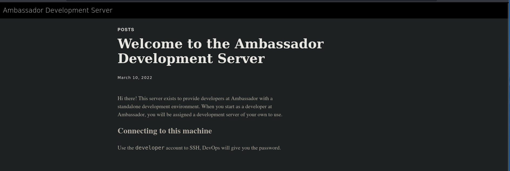

## Enumeration

### Open Port

```
PORT     STATE SERVICE REASON         VERSION
22/tcp   open  ssh     syn-ack ttl 63 OpenSSH 8.2p1 Ubuntu 4ubuntu0.5 (Ubuntu Linux; protocol 2.0)
| ssh-hostkey:
|   3072 29dd8ed7171e8e3090873cc651007c75 (RSA)
| ssh-rsa AAAAB3NzaC1yc2EAAAADAQABAAABgQDLYy5+VCwR+2NKWpIRhSVGI1nJQ5YeihevJqIYbfopEW03vZ9SgacRzs4coGfDbcYa+KPePbz2n+2zXytEPfzBzFysLXgTaUlDFcDqEsWP9pJ5UYFNfXqHCOyDRklsetFOBcxkgC8/IcHDJdJQTEr51KLF75ZXaEIcjZ+XuQWsOrU5DJPrAlCmG12OMjsnP4OfI4RpIjELuLCyVSItoin255/99SSM3koBheX0im9/V8IOpEye9Fc2LigyGA+97wwNSZG2G/duS6lE8pYz1unL+Vg2ogGDN85TkkrS3XdfDLI87AyFBGYniG8+SMtLQOd6tCZeymGK2BQe1k9oWoB7/J6NJ0dylAPAVZ1sDAU7KCUPNAex8q6bh0KrO/5zVbpwMB+qEq6SY6crjtfpYnd7+2DLwiYgcSiQxZMnY3ZkJiIf6s5FkJYmcf/oX1xm/TlP9qoxRKYqLtEJvAHEk/mK+na1Esc8yuPItSRaQzpCgyIwiZCdQlTwWBCVFJZqrXc=
|   256 80a4c52e9ab1ecda276439a408973bef (ECDSA)
| ecdsa-sha2-nistp256 AAAAE2VjZHNhLXNoYTItbmlzdHAyNTYAAAAIbmlzdHAyNTYAAABBBFgGRouCNEVCXufz6UDFKYkcd3Lmm6WoGKl840u6TuJ8+SKv77LDiJzsXlqcjdeHXA5O87Us7Npwydhw9NYXXYs=
|   256 f590ba7ded55cb7007f2bbc891931bf6 (ED25519)
|_ssh-ed25519 AAAAC3NzaC1lZDI1NTE5AAAAINujB7zPDP2GyNBT4Dt4hGiheNd9HOUMN/5Spa21Kg0W
80/tcp   open  http    syn-ack ttl 63 Apache httpd 2.4.41 ((Ubuntu))
|_http-server-header: Apache/2.4.41 (Ubuntu)
|_http-generator: Hugo 0.94.2
|_http-title: Ambassador Development Server
| http-methods:
|_  Supported Methods: HEAD GET POST OPTIONS
3000/tcp open  ppp?    syn-ack ttl 63
3306/tcp open  mysql   syn-ack ttl 63 MySQL 8.0.30-0ubuntu0.20.04.2
| mysql-info:
|   Protocol: 10
|   Version: 8.0.30-0ubuntu0.20.04.2
|   Thread ID: 10
|   Capabilities flags: 65535
|   Some Capabilities: Support41Auth, SupportsCompression, Speaks41ProtocolOld, FoundRows, ODBCClient, Speaks41ProtocolNew, InteractiveClient, SupportsTransactions, IgnoreSigpipes, SwitchToSSLAfterHandshake, DontAllowDatabaseTableColumn, LongPassword, IgnoreSpaceBeforeParenthesis, ConnectWithDatabase, SupportsLoadDataLocal, LongColumnFlag, SupportsMultipleStatments, SupportsMultipleResults, SupportsAuthPlugins
|   Status: Autocommit
|   Salt: -\x11g.3n\x19\x08P";5(X\x19V [97
|_  Auth Plugin Name: caching_sha2_password
1 service unrecognized despite returning data. If you know the service/version, please submit the following fingerprint at https://nmap.org/cgi-bin/submit.cgi?new-service
```

### Web Enumeration

No subdomains and directories were found.  The following information may be useful.



We have another web app running on port 3000. Web app is Grafana an opensource project.


Grafana 8.2.0 is vulnerable to [CVE-2021-43798](https://github.com/pedrohavay/exploit-grafana-CVE-2021-43798). 

I used the above-mentioned exploit and got the secret key - `SW2YcwTIb9zpOOhoPsMm` 


All the extracted files are saved in the local directory and its path is mentioned in the output. I grepped for the password string and got the admin password. 


Now I’m logged into the Grafana. 


I added the `grafana.db` into dbeaver and browsed through the tables. I found the password for mysql.yml connection (data source). 


Now I have the password - `dontStandSoCloseToMe63221!`

with the found `mysql` credentials we will connect to mysql and get the password. 


I found the password for a developer in base64 `developer:anEnglishManInNewYork027468`

## Privilege Escalation

I found the git file thus I tried to find the diff of the commit and noticed a token passed. 


This is the token that was used for consul `bb03b43b-1d81-d62b-24b5-39540ee469b5` . After some research, I found the exploit [POC](https://github.com/owalid/consul-rce) for consul HashiCorp. 

Initially, I thought POC didn’t work. Later I tried to curl my webserver. It did give me a request. Thus, I figured it doesn’t show the output for terminal commands.


Therefore, I set the SETUID bit for the bash and ran the bash to get a bash session with EID and EGID.


We have pawned the machine!